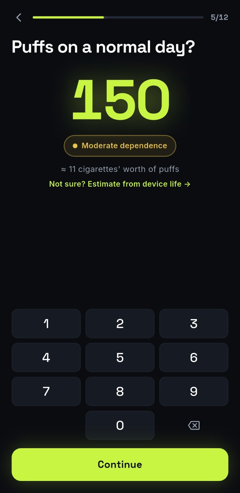

Every app in this category counts puffs. That's the easy part, and it's where most of them
stop. Five things separate one from another.

## 1. Does it start from your real number?

Plenty of trackers open by asking you to set a daily goal. That sounds reasonable and it's
backwards. A goal you picked on day one is a number you'd like to be true.

What you want is a few days of honest counting first, then a plan built on that. Otherwise
the app is measuring your optimism rather than your habit. Most people
[guess their daily count low, often by half](/blog/how-many-puffs-a-day-is-a-lot).

<figure class="figure--phone">

<figcaption>Start from a number you counted, not one you set as a target on day one.</figcaption>
</figure>

## 2. Does it cite anything?

Open any quit app's marketing and count the statistics with a source attached. It's usually
zero. "78% of members quit" is the kind of line that appears everywhere in this category
and traces back to nobody.

This matters beyond principle. If an app is willing to invent its success rate, you have no
way to judge anything else it tells you, including the numbers it shows about your own
progress.

## 3. What happens on a bad day?

Ask this one first, because it's the one you'll live with.

Some apps reset your streak to zero. That's a design decision that punishes you at the exact
moment you're most likely to delete the app, and it treats one slip as though it erased
three weeks of real change.

Better behaviour: the plan absorbs it. The streak dims rather than dies, and the schedule
stretches instead of restarting. A slip is data about a trigger, not a verdict.

## 4. Is the free tier usable, or a lockout?

"Free" covers a lot of ground. Some apps mean the counter works forever. Others mean you get
three days and then the thing you installed it for stops.

Counting, your daily limit and your streak are the core. If those are behind a paywall, it
isn't a free tier, it's a trial.

## 5. Is it on your phone?

The most practical filter, and the one most comparison articles skip.

**Checked 30 August 2026:**

| | Puff Count | Cirrus |
|---|---|---|
| iOS | Available | Not yet, planned as a fast-follow |
| Android | Listed as "coming soon to Google Play", waitlist only | First platform, launching soon |
| Price | Free | Free tier, paid plan for the adaptive plan and unlimited coaching |
| Counts puffs | Yes | Yes |
| Trigger patterns | Yes | Yes |
| Cites its statistics | Not on the site | Every figure, on the site and in the app |

We should be straight with you about two things there. Puff Count is the established option
with a real user base and it's genuinely free. And Cirrus isn't downloadable yet on any
platform, so if you want something to open tonight and you're on iPhone, that's your answer,
and we'd rather tell you than waste your evening.

If you're on Android, neither of us is shipping today, which is worth knowing before you
scroll through the store hoping.

## The thing no app can do for you

Tracking is one layer. The strongest evidence in vaping cessation is for stacking things: in
a 2025 JAMA trial, varenicline plus counselling plus text support produced a **51% quit rate
at 12 weeks** against **6%** for text support alone.

So whatever you install, it's worth a conversation with a doctor about varenicline too, and
[knowing the withdrawal timeline before you start](/blog/how-long-does-vaping-withdrawal-last)
so day two doesn't catch you off guard. There are free text programmes with real evidence
behind them as well: **This is Quitting** from Truth Initiative, and **quitSTART** from the
National Cancer Institute.

We'd rather you quit with someone else's app than not quit at all. But if you're on Android
and you want a counter that starts from your real number and cites what it tells you,
[that's what Cirrus is for](/). And whichever app you pick, pair it with
[a real quit plan](/blog/easiest-way-to-quit-vaping): the app is one layer, not the whole
thing.
