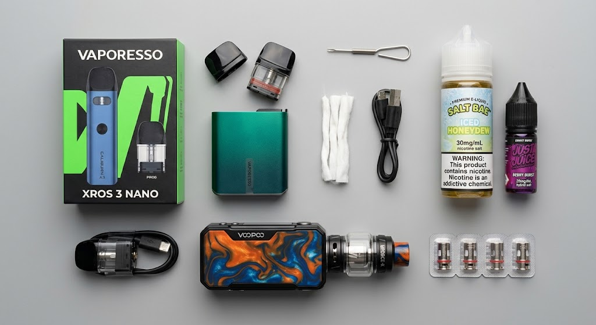
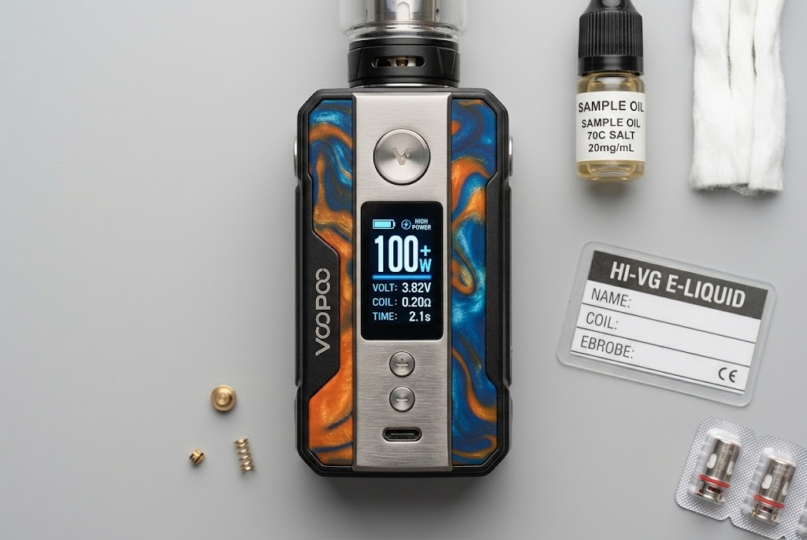
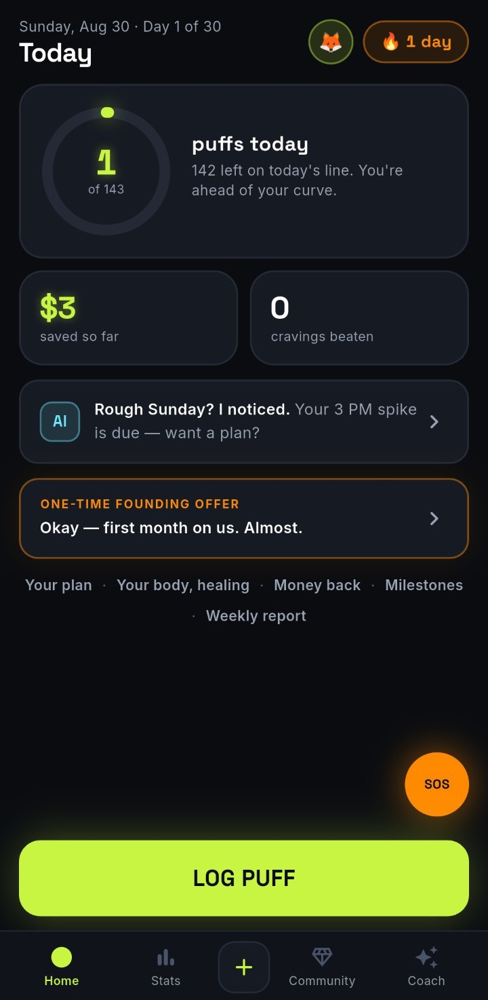

Somewhere at UC Davis last year, a researcher pulled the aerosol out of a cheap disposable vape,
ran it through a mass spectrometer, saw the lead reading, and assumed the machine was broken.

It wasn't.

<figure>

<figcaption>A refillable pod kit, a sub-ohm box mod, spare coils and nicotine-salt e-liquid at 30mg/ml.</figcaption>
</figure>

Five categories, ranked worst to least-bad on what's actually been measured: toxicant load,
how hard the thing is to put down, and whether anyone is checking what's inside it.

<table>
<thead>
<tr><th>#</th><th>Category</th><th>Brands</th><th>The core problem</th></tr>
</thead>
<tbody>
<tr><td>1</td><td>Illicit THC carts</td><td>Unbranded, counterfeit packaging</td><td>Vitamin E acetate, and acute lung injury</td></tr>
<tr><td>2</td><td>Nicotine-analog vapes</td><td>Spree Bar, SBX</td><td>A new molecule nobody has tested</td></tr>
<tr><td>3</td><td>Big-puff disposables</td><td>Geek Bar, Elf Bar, Lost Mary, Raz</td><td>Lead, nickel, plus 800mg of nicotine</td></tr>
<tr><td>4</td><td>Sub-ohm cloud mods</td><td>SMOK, Voopoo, Geekvape</td><td>Formaldehyde at 100+ watts</td></tr>
<tr><td>5</td><td>Authorized closed pods</td><td>JUUL, Vuse Alto, NJOY</td><td>Industrial-grade addiction</td></tr>
</tbody>
</table>

## 1. Illicit and counterfeit THC cartridges

**Risk: critical.** Unbranded street carts, counterfeit packaging, anything bought through
Instagram DMs.

This is the only vape here with a confirmed body count. In 2019, healthy young people started
arriving in hospital unable to breathe. There were 2,807 of them. Sixty-eight died.

The culprit was vitamin E acetate, a cheap oil used to bulk out fake THC carts. It turned up in
the lung fluid of 48 of 51 patients tested, and in none of the healthy controls.

Nothing structural has changed since. That supply chain still exists. The recipe just isn't
fashionable right now.

## 2. Nicotine-analog vapes

**Risk: severe.** Spree Bar, SBX, and anything labelled Metatine, Nixotine or Imotine.

These don't contain nicotine. They contain 6-methyl nicotine, which is one methyl group
different. That's just enough to fall outside the law regulating nicotine, so nobody had to
test it before selling it to you.

Early lab work suggests it grips your nicotine receptors up to 3.3 times harder than nicotine
does. The manufacturer's own website says it "may be addictive" and expects a similar toxicity
profile. It makes no claim that it's safer.

If you're vaping a brand you've never heard of, in a flavour that tastes engineered, read the
label.

## 3. High-capacity disposables

**Risk: high.** Geek Bar Pulse, Elf Bar, Lost Mary, Raz, Flum Pebble, Esco Bars.

This is the tier most people reading this are holding.

> One disposable released more lead in a single day of use than roughly 20 packs of cigarettes.
>
> <cite>Salazar et al., ACS Central Science, 2025</cite>

Nickel exceeded cancer-risk thresholds in every device tested. The reason is almost stupid.
One brand used a leaded bronze alloy for a part that isn't even the coil, and metal had leached
into the liquid before anyone took a first puff.

<figure>

<figcaption>Inside a disposable: battery, control board, saturated wick and coil, airflow sensor, brass contacts. The leaded alloy the UC Davis team found was in a part that does no heating at all.</figcaption>
</figure>

Then there's the dose. A Geek Bar Pulse holds about 800mg of nicotine, roughly 300 to 500
cigarettes, sitting in your pocket on your keys. You'll see "a thousand cigarettes" quoted
online. That's raw puff-count maths and it's inflated.

The only reason you can tolerate that strength is nicotine salts, which strip out the throat
burn that used to make people stop. That's the whole trick.

One fair caveat. The metals study covered three brands out of about a hundred. The rest weren't
tested. They weren't cleared either.

## 4. Sub-ohm cloud mods

**Risk: moderate.** SMOK, Voopoo, Geekvape, Vaporesso, Uwell.

Run a coil hot enough and the liquid stops being liquid and starts being formaldehyde. Sub-ohm
devices push 100 watts or more, about ten times a normal e-cigarette, and put out 7 to 15
micrograms of carbonyls per puff against under 2 at ordinary settings.

Counterintuitively, the worst readings come from *small* puffs with the airflow *closed*. Big
airy puffs cool the coil down.

<figure>

<figcaption>100 watts through a 0.20-ohm coil. Roughly the conditions that take carbonyls from under 2 micrograms per puff to somewhere between 7 and 15.</figcaption>
</figure>

It sits at 4 rather than 2 because these users run 3–6mg nicotine instead of 50, the hardware is
refillable and lead-free, and you control the wattage. Everywhere else on this list, someone in
a factory decided for you.

## 5. FDA-authorized closed pods

**Risk: elevated.** JUUL, Vuse Alto (tobacco flavours only), NJOY, Logic, Glas.

About 45 e-cigarettes hold FDA marketing authorization. Every other vape in America has none.

Two things worth knowing. **Authorized isn't approved.** The FDA decided the population-level
trade-off was acceptable, not that it's good for you. And **no vape is authorized to help you
quit.** Patches, gum and lozenges are. Vapes aren't.

Even here it isn't clean. A study following nearly 250,000 people over four years linked
exclusive vaping to COPD. The certainty is low, and we'll say so rather than oversell it.

What isn't in doubt is the hook. These run 5% nicotine salt. The EU caps liquid at 2%. The US
caps nothing.

## The ranking is a trap

You just scanned this for your own device and felt either relief or dread. Both are the wrong
answer.

Your category decides what you inhale. Your puff count decides whether you can stop. You picked
the device once, in four seconds at a counter. You pick the puff count four hundred times a day
without noticing, which is why [knowing your real puff count](/) matters more than knowing your
brand.

Youth vaping has fallen four years running. But 41% of young vapers are still on it 20 or more
days a month, and 27% use it daily. Fewer people start. The ones who stay are just as stuck.

## What actually works

A 2025 trial in *JAMA* followed 261 near-daily vapers aged 16 to 25.

<table>
<thead>
<tr><th>What they got</th><th>Quit at 12 weeks</th><th>Still quit at 6 months</th></tr>
</thead>
<tbody>
<tr><td>Varenicline + counselling + texts</td><td><strong>51%</strong></td><td><strong>28%</strong></td></tr>
<tr><td>Placebo + counselling + texts</td><td>14%</td><td>7%</td></tr>
<tr><td>Text support only</td><td>6%</td><td>4%</td></tr>
</tbody>
</table>

Varenicline is an old, cheap, generic prescription pill. It was well tolerated, and the people
who quit vaping didn't switch to smoking instead.

The useful bit is the pattern. The stack beats any single piece: medication, plus support, plus
something keeping count for you.

<figure class="figure--phone">

<figcaption>The third layer: what you did today, not what you think you did.</figcaption>
</figure>

That last layer is Cirrus, a [quit vaping app that counts your puffs and tapers them down](/)
instead of asking you to stop dead. It isn't a substitute for asking a doctor about varenicline,
so do both. Free options exist too: **This is
Quitting** from Truth Initiative, and **quitSTART** from the National Cancer Institute.

We'd rather you quit with someone else than not quit at all.
