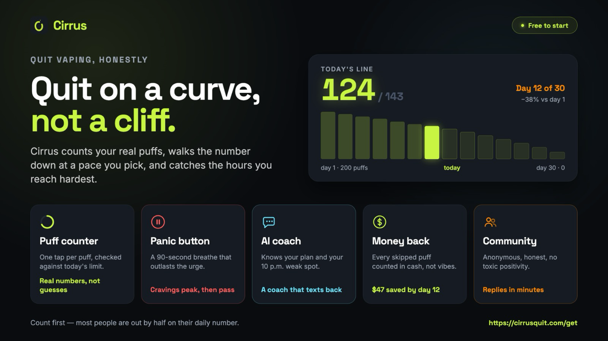

Nicotine does not care what delivered it. Leave a vape, a packet or a tin of pouches and the
same set of symptoms turns up, on roughly the same schedule, for roughly the same reason.

That is the useful thing about a timeline. It is not motivational. It is a map of a process
that has already been described in detail, so you can tell the difference between a bad
Tuesday and a quit that is failing.

Here is the shape of it.

## The short answer

Symptoms start within a day of your last dose. They peak on day two or three, which is
earlier than almost anyone expects. Most of the physical side settles inside two weeks, and
most of the rest inside a month.

Cravings outlast all of it, but they change character. Early on they are a shortfall being
reported. Later they are a place, a person or a moment that used to come with nicotine
attached, and those can surface a year later without meaning anything has gone wrong.

## The timeline

<table>
<thead>
<tr><th>When</th><th>What is usually happening</th></tr>
</thead>
<tbody>
<tr><td>30 minutes to 2 hours</td><td>Blood nicotine is already falling by half. Nothing to feel yet, but the clock has started</td></tr>
<tr><td>4 to 24 hours</td><td>First symptoms. A short fuse, restlessness, reaching for the thing without deciding to</td></tr>
<tr><td>Day 2 to 3</td><td>The peak. Worst concentration, worst mood, strongest cravings</td></tr>
<tr><td>Day 4 to 10</td><td>Steady improvement. Most of the physical side settles here</td></tr>
<tr><td>Week 2 to 4</td><td>Mostly through it. Sleep and appetite come back to normal</td></tr>
<tr><td>Month 2 onward</td><td>Occasional cravings, triggered by situations rather than by chemistry</td></tr>
</tbody>
</table>

The early peak is the part worth carrying around. Someone who expects the worst on day five
reads a terrible day three as proof that they are not built for this, when it is the single
most predictable moment in the whole thing.

## Why the crash lands so early

Nicotine has a half-life of about two hours. Half of what you take in is gone from your blood
before most of a morning is over, which is why a regular user tops up all day without ever
deciding to.

> Nicotine's short half-life is what makes it a frequent-dose drug.
>
> <cite>Benowitz, Hukkanen and Jacob, Handbook of Experimental Pharmacology, 2009</cite>

That speed explains both halves of the problem. It is why nicotine gets its hooks in so
efficiently - a few dozen small rewards a day, every day, for years. And it is why stopping
produces a cliff rather than a slope. By the second morning there is nothing left in the
system at all, and the receptors that adapted to a constant supply are all reporting at once.

Cotinine, which is what nicotine breaks down into, hangs around far longer - on the order of
sixteen hours. That is what drug tests look for, and it is why "nicotine is out of your
system" and "you feel fine" are two completely different dates.

## The seven symptoms, and the two nobody warns you about

The diagnostic manual recognises seven: irritability or anger, anxiety, difficulty
concentrating, increased appetite, restlessness, low mood, and disturbed sleep. A formal
diagnosis needs four of them.

Look at that list again. Four of the seven are mood or thinking. Only appetite and sleep are
obviously physical, and restlessness sits somewhere between. So the dominant experience of
nicotine withdrawal is not feeling ill - it is feeling like a worse version of yourself, in a
way that is very easy to blame on your character rather than on a receptor system doing
arithmetic.

The two that blindside people most are the ones that do not sound like withdrawal at all.
Concentration goes first and hardest, which is brutal if you quit during a work week and
lands as evidence that you are now bad at your job. And low mood is a listed symptom, not a
sign that quitting was a mistake, though it is extremely convincing in the moment. We wrote
about [the anxiety and brain fog specifically](/blog/quit-vaping-anxiety), because it is the
most reported part of this and the least explained.

One limit worth stating plainly: most of the research behind that list was done on smokers.
Applying it to vapes and pouches is borrowing, and everyone who does it - including us - is
borrowing.

## Vapes, cigarettes and pouches are the same withdrawal

The symptoms come from nicotine leaving, not from the device it left. So the list above does
not change when you switch products, and neither does the timeline.

What changes is the dose and how easily you could top it up. A cigarette is a discrete unit
that ends. A disposable vape has no unit at all, which is why people who have never counted
are usually out by a wide margin when they finally do - and why
[a taper needs a real starting number](/blog/how-many-puffs-a-day-is-a-lot) rather than a
guess. Pouches sit somewhere in between: countable, but silent and usable anywhere, which
tends to mean a higher daily total than the user believes.

If you are specifically leaving a vape, the
[vaping-specific version of this timeline](/blog/how-long-does-vaping-withdrawal-last) goes
into the differences.

## When it is not withdrawal

A timeline is only useful if it also tells you when to stop using it as an explanation.

Withdrawal is self-limiting. It has a peak and it comes down. Something that is still getting
worse in week three, or that arrives for the first time a month in, is not following this
pattern and should not be filed under it.

It is also not a general-purpose cause. Fever, chest pain, breathlessness, severe headache and
vomiting are not on the list of recognised symptoms. Neither is anything that frightens you.
Those belong to a doctor, and the fact that you recently quit is a detail to mention rather
than a diagnosis to settle for.

The harder version of this is mood. Low mood is a genuine listed symptom, and it usually
lifts with everything else. But if it deepens instead, or comes with thoughts of hurting
yourself, that is not a quit going badly. That is a separate thing that needs a person, today.

## What actually helps

The strongest evidence is for combining medication with human support rather than picking one
thing. That conversation belongs with a doctor or pharmacist, and it is the highest-value
thing on this page. Cochrane's review of vaping cessation, current to July 2025, rates the
medication evidence promising but low-certainty, and we would rather say that than oversell
it.

Beyond medication, the things that help are unglamorous and mostly about timing:

- **Know the peak is day two or three.** Plan a light week around it rather than a heavy one.
- **Treat a craving as a fifteen to twenty minute event**, because that is roughly what it is.
  Something to do with your hands usually covers the whole ask.
- **Come down rather than jump.** Lowering the dose in steps means you never meet the full
  drop at once. It trades speed for the odds of it holding.
- **Eat properly in week one.** Appetite is a listed symptom, and hunger is a terrible
  companion for irritability.

## Where Cirrus fits

<figure>

<figcaption>Illustration only. The card shows a taper. The app runs cold turkey too.</figcaption>
</figure>

Full disclosure: [Cirrus](/) is our app. It is not a medication and has not been trialled, so
it replaces nothing above. It is built for the part of this page that is hardest to do alone:

- **The first 72 hours**, with a panic button, a 4-7-8 breathing pacer and a craving timer you
  can watch the wave pass on.
- **The drop itself**, by counting what you actually take and stepping it down from your own
  number instead of asking you to stop dead on a Monday.
- **Day two or three**, when a bad day reads as failure. A slip spends a repair token instead
  of erasing the streak.

**[Get Cirrus, free to start](/download)**, on iPhone or Android.

## The bottom line

Nicotine withdrawal is short, early and well described. It starts within a day, is worst on
day two or three, and is mostly behind you inside a month. The cravings that outlive it are a
different animal, and they answer to habit rather than to chemistry.

None of that makes it pleasant. It does make it finite, and knowing which day is the bad one
is most of what separates people who sit through it from people who read it as a verdict.

So put a date on it, book a light week around day three, and get through the next fifteen to
twenty minutes. Then do it again.
