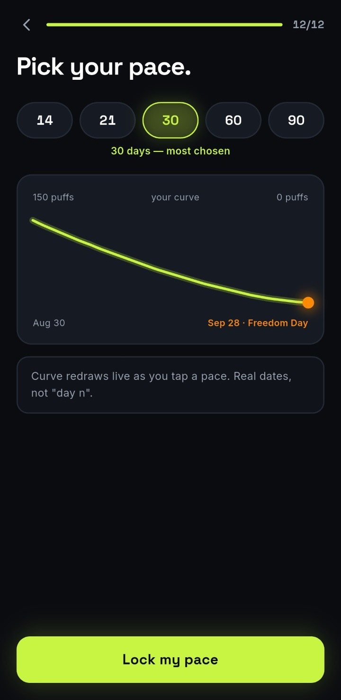

First, congratulations. Deciding you're done is the part most people never get to.

What happens after that is your body stops waiting for the next hit and starts adjusting to
not getting one. Nicotine levels fall, your brain notices, and for a few days it files what
can only be described as a formal complaint.

This is the honest version of that timeline: what has actually been measured, what has been
borrowed from smoking research, and where the hard part really sits.

## What happens to your body when you quit vaping

Vaping delivers nicotine on a schedule your brain has learned to expect. Stop, and it has to
run without it.

Nicotine's half-life is roughly **two hours**, which is most of the chemical story in one
number. Most of it is out of your blood inside a day, so almost nothing that feels hard on
day three is the drug still being there. It's your receptors readjusting to a supply that
stopped.

That readjustment shows up as:

* Strong cravings
* Irritability, or a shorter fuse than usual
* Anxiety and restlessness
* Headaches
* Trouble concentrating
* Broken sleep
* More appetite
* Feeling tired or mentally foggy

None of that means something is wrong with you. It's a nervous system recalibrating, and
recalibration takes a specific and finite amount of time.

<table>
<thead>
<tr><th>When</th><th>What's usually going on</th></tr>
</thead>
<tbody>
<tr><td>20 minutes to 4 hours</td><td>Nicotine levels start falling. First cravings, mostly cue-driven</td></tr>
<tr><td>Day 1</td><td>Most of the nicotine has cleared. Irritability, restlessness, reaching for a device you've moved</td></tr>
<tr><td>Days 2 to 3</td><td>The peak. Worst concentration, worst mood, strongest cravings</td></tr>
<tr><td>Days 4 to 7</td><td>Physical symptoms start settling. Sleep and focus begin coming back</td></tr>
<tr><td>Weeks 2 to 4</td><td>Chemistry mostly done. The habit takes over as the harder half</td></tr>
<tr><td>Months 1 to 3</td><td>Cravings become occasional and cue-driven rather than constant</td></tr>
</tbody>
</table>

If the question you actually came with is *when does this end*, we answered the duration
question on its own in [how long vaping withdrawal lasts](/blog/how-long-does-vaping-withdrawal-last).
This piece is the other half, which is what each stage feels like from the inside.

## The first 20 minutes to 4 hours

Your body responds faster than most people expect, because nicotine leaves faster than most
people expect.

We should be straight with you about one thing before going any further. You will find the
same timeline on every page written about this: *20 minutes and your heart rate drops, 12
hours and your carbon monoxide normalises, 72 hours and your lung capacity increases.* That
timeline comes from **smoking** cessation research. Vaping doesn't burn tobacco, so it
doesn't produce carbon monoxide, and the milestones underneath those numbers were measured
on a different product.

Nicotine does raise your heart rate and blood pressure while it's in you, and that effect
passes as it clears. What nobody has established is a tidy stopwatch of vaping-specific
milestones. Everyone publishing one is extrapolating, and most of them aren't saying so.

The first cravings usually land in this window, and they're rarely chemical. They're about
routine, reaching while you're driving or working or halfway through a coffee, and then
remembering.

That isn't failure. It's your brain running a subroutine it wrote four hundred times a day.

**What you may notice:** early cravings, restlessness, irritability, trouble sitting still,
and a strong pitch for "just one hit."

Try not to negotiate with that last one. *Just one* is nicotine's best salesman.

## Day 1: the first 24 hours without vaping

By the end of the first day most of the nicotine is gone. What's left is a brain that keeps
checking a pocket.

You might get irritability, anxiety, headaches, poor concentration, restlessness, strong
cravings and an appetite that won't settle. Or you might get a surprisingly manageable day
and then find yourself ambushed on Tuesday. Both are normal, and the second one catches more
people out.

You'll also think about vaping more than you did when you were actually doing it, which
feels backwards until you consider that a habit you never had to notice becomes very loud
the moment you interrupt it.

**Your job on day one is small on purpose: get through today.** Not forever, not the rest of
your life. Today, and if today is too big, the next hour.

## Days 2 and 3: the peak of nicotine withdrawal

For most people, **days two and three are the worst of it**, and knowing that in advance is
genuinely useful. People who brace themselves for a terrible first week tend to read a bad
Tuesday as proof that quitting isn't working for them, when it's the most predictable moment
in the whole process.

Expect cravings at their strongest, plus some combination of headaches, irritability,
anxiety, restlessness, poor sleep, poor concentration, more appetite and a general sense of
being uncomfortable in your own day.

This is the stage where your brain makes its best offer: *maybe quitting tomorrow would be
easier.*

It wouldn't. Tomorrow would just be another day two.

### Ride the wave instead of fighting it

Treat a craving as weather rather than a negotiation. It rises, peaks, gets genuinely
unpleasant and then passes on its own, whether or not you do anything about it.

> Individual cravings last 15 to 20 minutes.
>
> <cite>Nicotine craving literature</cite>

Carry that number around with you. A craving feels open-ended while you're inside it and it
isn't. Twenty minutes of doing something else with your hands is usually the whole ask: a
walk, water, gum, cold air, a task that needs your attention. We went through the
substitutes that actually hold up in
[our ten-step guide to quitting vaping](/blog/easiest-way-to-quit-vaping).

You're not trying to defeat cravings permanently. You're trying to let this one pass without
acting on it.

## Days 4 to 7: things start turning around

Welcome to the *okay, this might actually be working* stage.

For most people the sharpest physical symptoms start easing during the first week. Headaches
thin out, cravings arrive less often, and sleep and concentration begin returning to
something recognisable.

Cravings still show up, but they change character. They stop being chemical and start being
triggered:

**Coffee → vape. Driving → vape. Stress → vape. Bored for fourteen seconds → apparently also
vape.**

Those are learned associations, and the only thing that breaks them is doing the trigger
without the payoff, over and over.

Some people also notice a cough or a change in mucus around here. It's commonly reported and
doesn't automatically mean something is wrong, but it isn't a guaranteed "detox" stage
either, and anything severe or persistent belongs with a doctor rather than a blog post.

## Weeks 2 to 4: where the real fight moves

By the second to fourth week the physical side is largely behind you, which is when a lot of
people discover the actual problem: **they don't miss nicotine, they miss the routine.**
After eating. On work breaks. With coffee. Under stress. When bored. Out with friends.
Driving.

This is also where the danger sits. The hard part looks finished, one puff seems survivable,
and the count quietly creeps back. That isn't withdrawal any more, it's habit, and habit
outlasts chemistry by a wide margin. The plan you follow in week three matters more than the
one you followed in week one.

The good news is that every one of those situations you get through without vaping counts as
a rep, and the routine gets less automatic each time. Brain fog, concentration and energy
usually improve through this stretch too, and you start noticing you can get through an
ordinary afternoon without carrying your emotional support USB stick.

## Months 1 to 3: building the new normal

After the first month, quitting stops being about surviving withdrawal and starts being
about maintaining a life that doesn't have vaping in it.

People commonly report better exercise tolerance, more energy and easier breathing. The one
that tends to sneak up on you is subtler than any of those: a sense of being in charge of
your own afternoon again.

Cravings can still appear, usually under stress or around people who vape. That isn't a
relapse and it isn't square one. It's an old trigger meeting a brain that now has somewhere
else to go.

## What happens to your lungs when you quit vaping?

Less is known here than the internet implies.

What you can say with confidence is that you've stopped the ongoing exposure to vape
aerosol, which is the variable you control. Some people notice breathing and exercise feel
easier within weeks, while others notice it more gradually. Vaping-specific recovery
research is young, and we're not going to invent a milestone chart to fill the gap.

One thing is not ambiguous. **Persistent chest pain, significant shortness of breath or
coughing up blood is not part of quitting.** Don't wait it out. See someone.

## When does nicotine withdrawal from vaping actually end?

There's no day when it switches off.

The intense physical part is concentrated in the first few days and eases over the following
couple of weeks. The psychological part, meaning the cues and the routines and the specific
chair you always vaped in, lasts longer and fades by exposure rather than by time.

The distinction worth holding onto is that **a craving is not the same thing as needing to
vape.** One is a signal. The other is a decision, and it stays yours.

## How to make quitting vaping easier

Knowing the timeline helps. Having a plan for the first week helps more.

### 1. Get the vape out of the house

Not in a drawer "just in case." That's putting cookies on your desk and then blaming your
willpower. Device, pods, chargers, the spare in the car, all of it.

### 2. Name your triggers before they name you

Write down when you actually vape. After meals? In traffic? On the third work call? With the
first coffee?

One useful tell is reaching for it within 30 minutes of waking. **76% of young vapers do**,
and if that's you it's a dependence pattern rather than a willpower problem, which changes
what will actually work.

### 3. Keep your hands busy

Vaping is a hand-to-mouth habit as much as a chemical one. Gum, water, a walk, a stress
ball, anything that occupies the same loop.

### 4. Know your real starting number

Most people underestimate their daily puff count, often by half. That matters because a plan
built on a guess is a plan built on optimism. We went into
[what a heavy daily count actually looks like](/blog/how-many-puffs-a-day-is-a-lot)
separately.

### 5. Take it one craving at a time

Not *I can never vape again.* Just: **I'm not vaping right now.**

Then make the same decision again when the next one shows up. That's the whole method, and
it's the only one that works at 2pm on day three.

## What the evidence says actually works

The strongest signal in vaping cessation research right now is for stacking approaches
rather than picking one. In a 2025 *JAMA* trial of 261 near-daily vapers aged 16 to 25,
varenicline plus counselling plus text support produced a **51% quit rate at 12 weeks**,
against 6% for text support alone.

Varenicline is an old, cheap, generic prescription pill, and it's worth an actual
conversation with a doctor. The Cochrane review current to July 2025 rates that evidence
promising but low-certainty, and finds text-message programmes helpful for young adults.
That's the honest strength of it rather than a stronger claim.

Free support exists too. **This is Quitting** from Truth Initiative and **quitSTART** from
the National Cancer Institute both cost nothing, and we'd rather you quit with someone else
than not quit at all.

The third layer in that stack is something that keeps count for you, so the plan runs on
what you actually did rather than what you remember doing.

<figure class="figure--phone">

<figcaption>A taper spreads the drop instead of taking it all on Monday. Real dates, and a starting number you counted.</figcaption>
</figure>

That's what [Cirrus](/) does. It counts your real puffs, finds the hours you reach hardest
and walks the number down to zero at a pace you pick, which is a different bet from stopping
dead and meeting day two at full force. It's free to start, and it isn't a substitute for
asking a doctor about medication, so do both.

## The bottom line

When you quit vaping, nicotine clears in about a day, withdrawal peaks around day two or
three, and the physical side largely settles over the first couple of weeks. After that the
job changes. It stops being about chemistry and becomes about the routines built around it.

There will be bad days. There will be cravings out of nowhere. Your brain will occasionally
mount a compelling case that buying one vape is a brilliant idea.

It isn't.

Every vape-free day is more distance from nicotine and one more rep against the habit. You
don't have to quit perfectly, you just have to keep going. And if you'd like something
counting alongside you for that first week, [Cirrus is free to start](/download).
