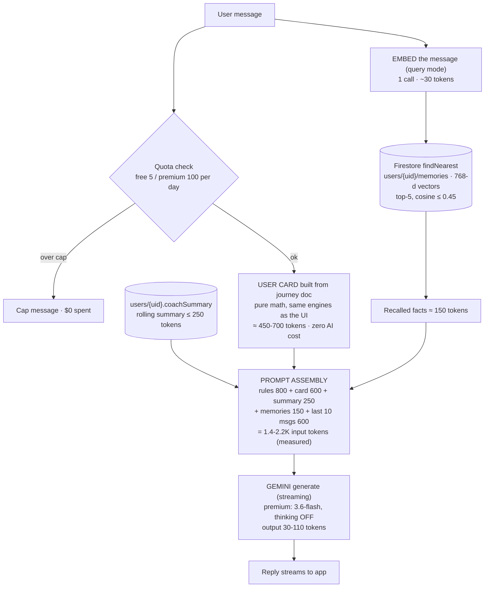
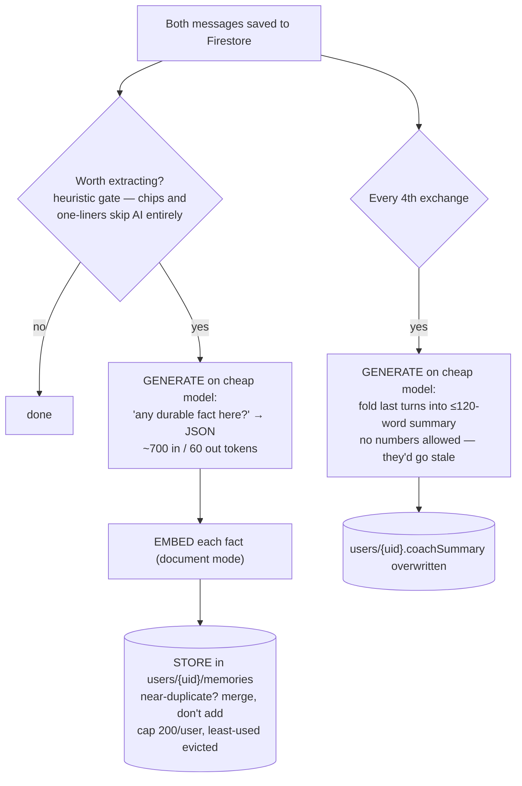

# AI Flow — the pipeline, and the economics

For a technical lead: how data moves through the system, how **embeddings** and **generation
tokens** work together, and what 1,000 paying users cost and earn. No code, just the workflow.

## 1. The two AI primitives (and how they cooperate)

- **Generation** (Gemini chat models) is the expensive primitive. Cost = input tokens
  (everything we send) + output tokens (the reply). Every design choice below exists to keep
  input tokens small without losing knowledge.
- **Embedding** (gemini-embedding-001) turns a sentence into a 768-number vector so Firestore
  can find "similar meaning" with a `findNearest` query. It costs ~1/1000th of generation.

**The relationship:** embeddings are the *filter* that decides which text earns a place in the
prompt. Instead of sending months of history (100K+ tokens), we send the 5 most relevant
remembered facts (~150 tokens). Retrieval is the token-budget control system.

## 2. The per-turn pipeline (read path)

Order matters for cost: **quota before any AI call** (a refused message costs $0), the card is
**computed, not generated** (exact numbers, zero AI cost), and thinking is disabled (we probed:
the previous premium model burned 400–2,000 hidden "thought" tokens per reply — pure waste).

## 3. After the reply (write path — where embeddings get created)

So the full loop is exactly what you sketched: **data (journey) → deterministic feed (card) +
message → embedding → Firestore vector search → Gemini → response → extraction → embedding →
Firestore**. Query-mode embeddings *read* the store; document-mode embeddings *write* it.

Three-layer memory, by freshness and cost:

| Layer | Source | Freshness | Token cost/turn | AI cost to maintain |
|---|---|---|---|---|
| User card | journey doc + math engines | rebuilt every turn | ~600 | $0 |
| Rolling summary | cheap-model generation | every 4th exchange | ~250 | ~$0.0002 / 4 turns |
| Vector memories | extraction + embeddings | on new facts | ~150 | ~$0.0001 / turn |
| Last 10 messages | Firestore | live | ~600 | $0 |

## 4. Cost per turn (flash-class list rates, input measured in prod at 1.4–1.8K)

| Item | Tokens | Cost |
|---|---|---|
| Reply generation (premium) | ~2,000 in / ~100 out | ~$0.00085 |
| Fact extraction (cheap model) | ~760 | ~$0.0001 |
| Summary, amortized over 4 turns | ~1,500 / 4 | ~$0.00005 |
| Embeddings (1 query + occasional docs) | ~100 | ~$0.00002 |
| **Total per premium turn** | | **≈ $0.001** |

## 5. Economics at 1,000 subscribers on the weekly plan ($2.99/week)

Monthly, unit-economics snapshot (excludes churn, refunds, staff):

| Line | Calc | Amount |
|---|---|---|
| Gross revenue | $2.99 × 52 ÷ 12 × 1,000 | **$12,957** |
| Store commission | −15% | −$1,944 |
| **Net revenue** | | **$11,013** |
| AI generation + embeddings | ~6 msgs/day avg × 30 × 1,000 × $0.001 | −$180 |
| Infra (2 warm instances, Firestore ops, functions compute) | | −$50 |
| **Contribution margin** | | **≈ $10,780 (~98% of net)** |

Sensitivity: every user averaging a heavy 20 msgs/day → AI ≈ $600/mo (still 5% of net).
Absolute worst case is **bounded by design**: the 100/day cap makes maximum exposure
1,000 × $3 = $3,000/mo, and the `AI_COST_PANIC` switch can route all traffic to the cheap
model (~4× cheaper) without a deploy. Per-user: $11.01 net vs $0.18–0.60 COGS.

Scaling: costs are linear in messages, not users (a silent subscriber costs ~$0). The stack
(Functions + Firestore per-user vector search over ≤200 docs) has no re-architecture point
before ~100K MAU; the only growth action is a Gemini quota increase.

## 6. The guarantees the pipeline enforces

- **No invented numbers** — every stat the coach says comes from the card, computed by the
  same engines as the UI. Retrieval and summaries are banned from carrying numbers.
- **Spend is gated** — quota transaction before any model call; failed replies are refunded.
- **Vendor-swappable** — one adapter file speaks to Gemini; models are deploy-time config.
  (Swapping the *embedding* model requires re-embedding stored vectors — vectors from
  different models aren't comparable.)
- **Release gate** — 19 scripted conversations run against both live models
  (`npm run eval:coach`, ~$0.15/run); non-green blocks deploy.
- **Erasure** — memories, summary, chats all live under `users/{uid}`; one recursive delete.
